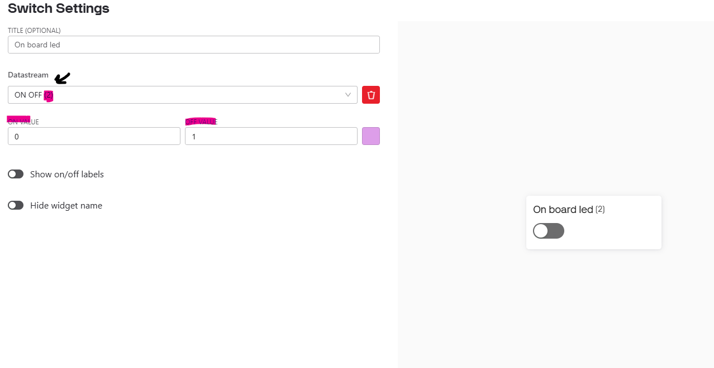

# LAB 10 IOT DEVICE

This lab was interesting and I learned a lot. I have in this Git hub the Video, and some screenshots on how I got it working. 

I followed the lab instructions to the best of my ability, and was going to push to get the BLYNK to work with external GPIO, however after recording the video above It completly stopped working, and now my ESP8622 will reset every 10 seconds. It connects to the server, then instantly reboots. 

You can see my DEMO here : [Watch the video](demo.mp4)

And this is the screenshot of how I got the switch to work 

Under datastream, there is how I selected the pin, it was given a name when I created the Data Stream. And I set the on and off values to be 0 and 1, because the onboard led is active low. IN the video however it doesnt show that. I wasnt able to get it working after I recorded the video for some reason.  

To view my code you click [here](ESP8266.ino)